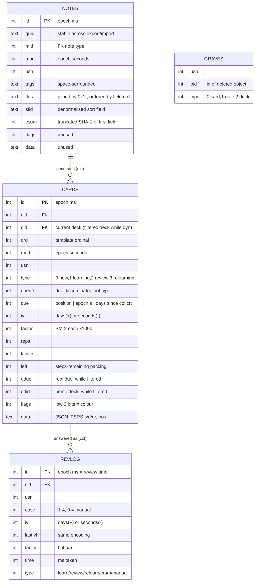
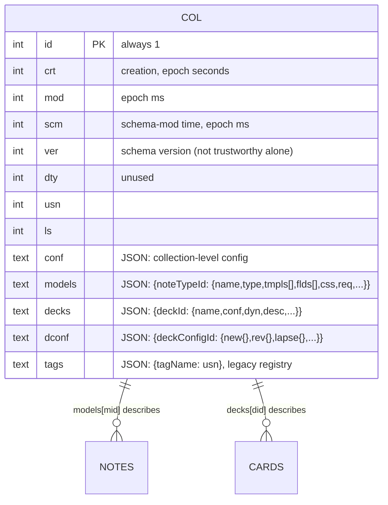
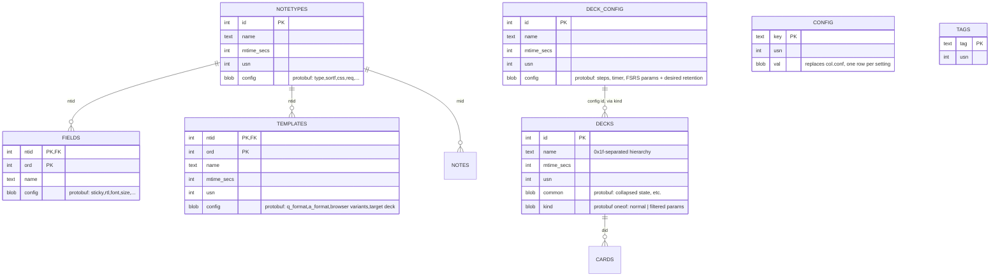

# Anki schema diagram

Visual companion to [anki-schema.md](anki-schema.md), which is the source of truth for
column-level detail and verification status. This is Anki's own schema, not Enshu's — see
[schema-diagram.md](schema-diagram.md) for ours. Regenerate by hand if `anki-schema.md`'s
shape changes.

- [Shared tables](#shared-tables) — `notes`, `cards`, `revlog`, `graves`, present unchanged
  across schema versions
- [Legacy collection (schema ≤11)](#legacy-collection-schema-11) — content and config as
  JSON blobs inside `col`
- [Modern collection (schema 18+)](#modern-collection-schema-18) — content and config as
  real tables

> [!warning]
> Same unverified status as `anki-schema.md`: the legacy diagram matches the one real export
> inspected so far (✅, see `apkg-format.md`); the modern diagram is reconstructed from memory
> and unchecked against a real schema-18 file (❓).

---

## Shared tables

The four tables that don't change shape between schema versions. `cards` is drawn with both
`did`/`odid` — the filtered-deck pair where one shadows the other, detailed in
`anki-schema.md`.

`GRAVES` has no drawn edges — it's a tombstone log keyed loosely on `oid` against whichever
table `type` names, not a real foreign key, and it exists for sync propagation we don't use
(CLAUDE.md §9).

---

## Legacy collection (schema ≤11)

Note types, decks, and deck options as JSON objects inside the single-row `col` table, keyed
by entity id. ✅ Matches the one verified export.

`models[id].tmpls[].ord` and `flds[].ord` are authoritative over JSON array position — the
array can disagree with `ord` (`anki-schema.md`). Deck hierarchy in this form uses `::` as
the path separator, unlike schema 18's `\x1f`.

---

## Modern collection (schema 18+)

Note types, decks, and deck options promoted to real tables; per-row settings become a
protobuf blob instead of a JSON object value. ❓ Entirely unverified against a real file —
reconstructed from the format's known shape, same caveat as `anki-schema.md`.

`NOTES`/`CARDS` themselves are unchanged from [Shared tables](#shared-tables) — only what
describes them moves. `col.models`/`col.decks`/`col.dconf` columns still exist on a schema-18
`col` row but are emptied, not dropped, which is why table presence (not `col.ver`) is the
reliable way to tell the two schemas apart (`anki-schema.md`).

`COLLATE unicase` is declared on the name columns here (`notetypes.name`, `decks.name`,
`fields.name`, `templates.name`) — a real client-side detail, not a Mermaid artifact, and the
reason `ORDER BY name` is avoided in favour of ordering by id.
