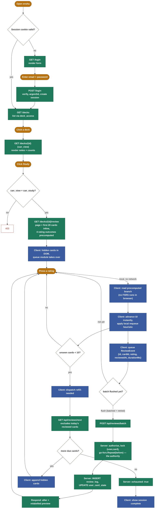

# Review flow: login to the next card

Visual companion to [architecture.md §6](architecture.md#6-the-review-loop) — same loop, as a
diagram and step tables instead of prose. Route details are pinned down in
[routes.md](routes.md); this doc doesn't repeat them beyond what each step needs.

The part that matters most is the grading loop: the client picks a precomputed branch and moves
on with **no network wait** (CLAUDE.md §2.6); the server independently recomputes and stores the
real answer, and that recompute — never the client's guess — is what lands in `review_log`
(CLAUDE.md §2.7).

Legend: 🟠 user action · 🔵 client / UI
(the reviewer's JS queue module) · 🟢 server (Go handler + DB) ·
diamonds are decision points, the dashed node is a rejected/blocked path.

**What never crosses the wire:** a `predicted` or `stability` field. The batch POST accepts
exactly `{id, cardId, rating, reviewedAt, durationMs}` — the client asserts *what happened*, the
server derives *what follows*.

## Steps 1–5: reaching the reviewer

| | User does | UI does | Server does |
|---|---|---|---|
| 1 | Opens enshu | — | `GET /` — authed → redirect `/decks`; else → redirect `/login` |
| 2 | Submits email + password | Renders the login form | `POST /login` — verify credentials (`argon2id`), create session, cookie = hashed token |
| 3 | Lands on the deck list | Renders deck cards | `GET /decks` — decks reachable via `deck_access` |
| 4 | Clicks a deck | Renders notes list, note/card counts | `GET /decks/{id}` — permission `can_view` |
| 5 | Clicks "Study" | — | `GET /decks/{id}/review` — permission `can_view`+`can_study`; renders the reviewer page **and** the first 20 cards inline, each with all four rating outcomes already computed |

## Steps 6–9: the grading loop — repeats until exhausted

| | User does | UI (client) does | Server does |
|---|---|---|---|
| 6 | Presses a rating (Again / Hard / Good / Easy) | Looks up the precomputed branch for that rating — no FSRS in the browser — applies it to the in-memory queue, advances the UI immediately | idle — nothing sent yet |
| 7 | (keeps grading) | Queues a `ReviewEvent`; sends are batched (kind to mobile radios) and retried with backoff | `POST /api/reviews/batch` — per event: authorise via `deck_access`, advisory lock on `(user, card)`, recompute with `go-fsrs.Repeat(before)` — same call the preview used — then store. Idempotent: a retried batch is a no-op |
| 8 | — | Fewer than 10 unseen cards left → dispatches `refill-needed` | `GET /api/reviews/next` — keyset-paged fragment, excludes cards already reviewed this study day |
| 9 | — | Appends the new hidden cards to the DOM, or shows "session complete" | Sets `exhausted: true` once no due cards remain — an explicit terminal signal, not a poll loop |
