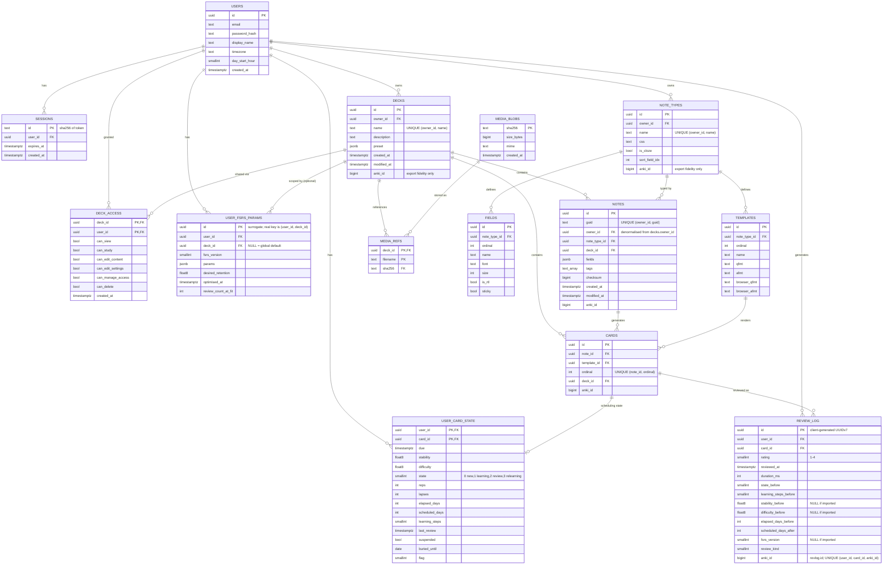
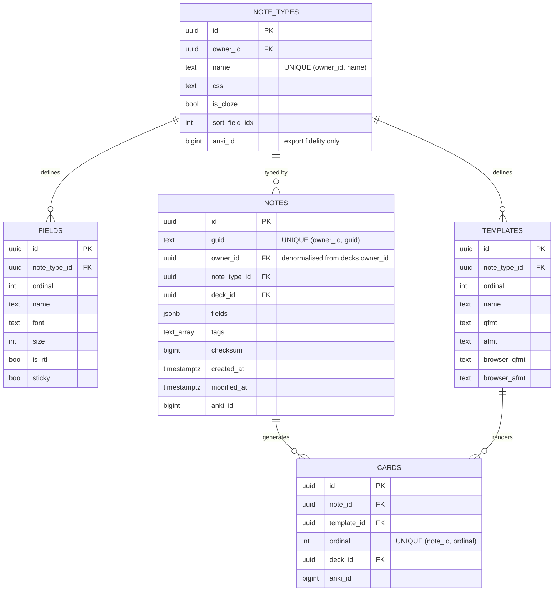
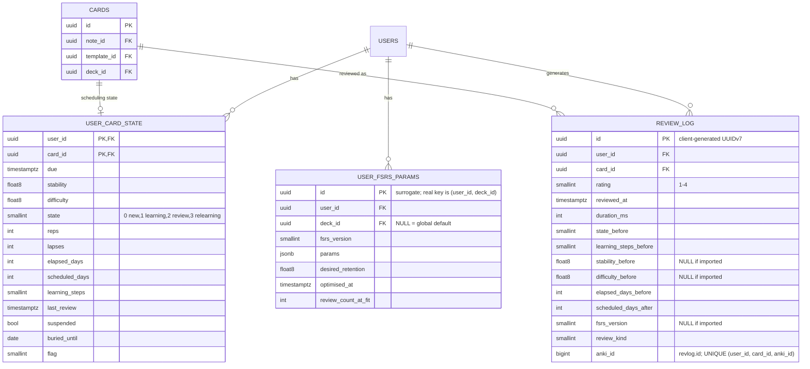
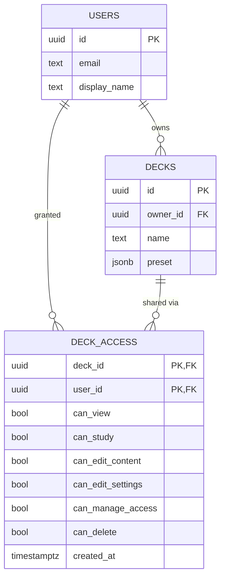
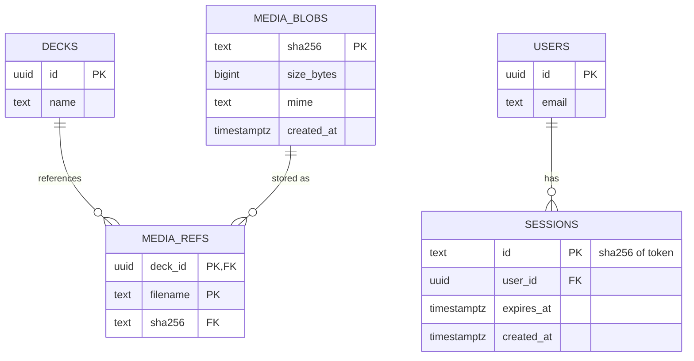

# Schema diagram

Visual companion to [schema.md](schema.md), which is the source of truth for rationale and
column-level detail. Regenerate this by hand if the shape in `schema.md` changes.

- [Full schema](#full-schema)
- [Content & authoring core](#content--authoring-core) — note types, fields, templates,
  notes, cards
- [Per-user scheduling](#per-user-scheduling) — the FSRS-critical subset
- [Access & sharing](#access--sharing) — users, decks, deck access
- [Media & auth](#media--auth) — content-addressed media, sessions

---

## Full schema

**Reading this diagram:**

- No edge runs from `CARDS` to any scheduling column — that separation (content vs.
  `USER_CARD_STATE`) is the invariant the whole schema protects (CLAUDE.md §2.1).
- `CARDS ||--o|  USER_CARD_STATE` is one-per-`(user, card)` pair, not one-per-card; the
  diagram can't express the composite key directly, see `schema.md` for the real PK.
- The uniqueness annotations are the re-import dedup keys. Decks and note types key on
  **name**, the way Anki's own importer does — `anki_id` is per-collection (deck id 1 is
  `Default` everywhere), so keying on it merges unrelated collections. `review_log` is the one
  exception, since `revlog.id` genuinely identifies a row within its collection. See
  `schema.md`.
- `DECK_ACCESS` is the only path by which a deck reaches a second user. There is no visibility
  flag and no public-deck carve-out (CLAUDE.md §9), so every cross-user edge in this diagram
  passes through that table.

---

## Content & authoring core

`note_types` → `fields` + `templates`, and how a note type turns one `notes` row into N
`cards` rows. No users, no scheduling — this is what a deck's *content* is, independent of
who owns it or who's studying it.

One note type's fields feed both the note (values) and the templates (rendering rules);
`CARDS` is the join of a note with the template ordinal that generated it — cloze note types
are where "N cards per note" stops being 1:1.

---

## Per-user scheduling

`user_card_state`, `review_log`, and `user_fsrs_params` — the tables the FSRS wrapper reads
and writes, and the ones invariant §2.1 exists to protect. `CARDS` appears only as the
anchor they key off of, stripped of its content columns.

`CARDS ||--o| USER_CARD_STATE` is drawn one-per-card because Mermaid can't express the real
composite key; the actual PK is `(user_id, card_id)`, i.e. one row per *pairing*, not one per
card. `USER_FSRS_PARAMS` doesn't reference `CARDS` at all — it's scoped to `(user_id,
deck_id)`, which is why it's absent from the edges above.

---

## Access & sharing

`deck_access` as the join table between users and decks — the only way a deck reaches someone
who doesn't own it. Small, but the shape Milestone 2's deck sharing and Milestone 3's classroom
cohorts build on.

A user reaches a deck they don't own through `DECK_ACCESS` and nothing else. Their progress on
it still lives in their own `user_card_state` rows, which key off `card_id` and appear in the
scheduling diagram rather than this one — sharing content never shares progress.

---

## Media & auth

Two small, self-contained subsystems that don't interact with each other or with the rest of
the schema beyond a foreign key each — grouped together because neither earns a full diagram
alone.

Media is content-addressed and deduplicated across *all* decks, not just one owner's — two
decks shipping an identical image share one `MEDIA_BLOBS` row. Sessions store only the
token's hash; the raw token lives in the cookie and never touches the database.
